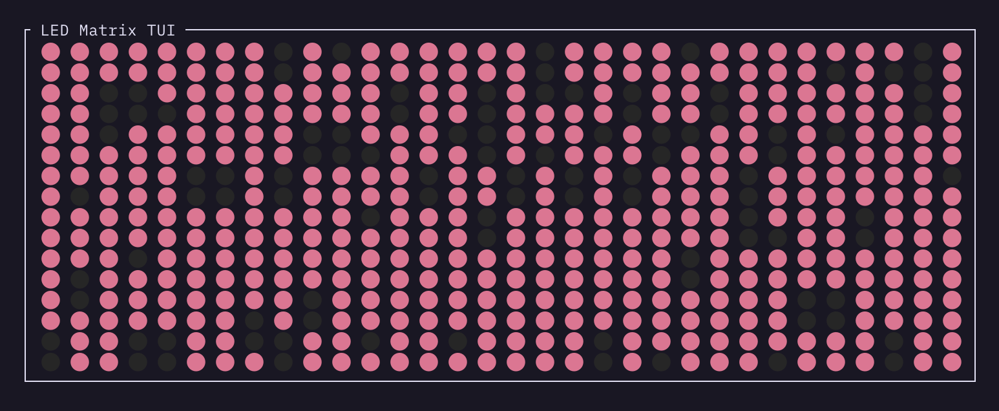
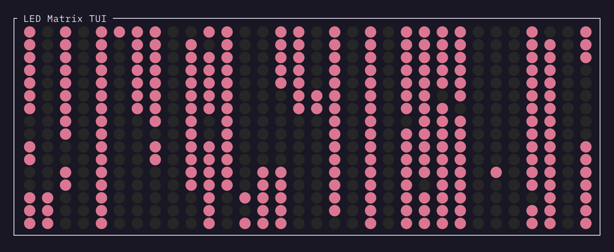
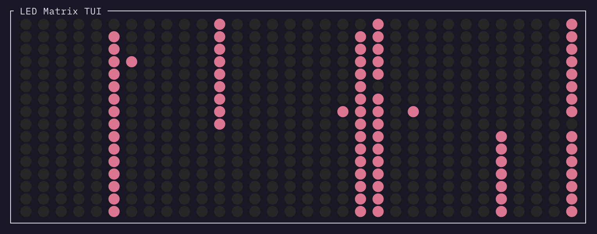

# Lume

Lume is a simple library to display current usage of resurces with LEDs only.
It is designed to mimick the look of CM-1 and CM-2 machines from the Thinking Machines Corporation.
The overall goal of the project is to achieve a pleasing and modern look for the visualization while preserving 
functionality.

Currently supports CPUs and NVIDIA GPUs.

## Usage

### CPU
To visualize cpu load for the current machine in TUI run
```
  cargo run cpu
```
Workload is visualized in columns, one column per cpu core. Number of lit lights in the column visualize how much core is occupied (all lit - full load, no lights - no load).
Visualization was designed to have esthetic look while allowing to estimate resource in an eyes glance.


*Very high load - all 32 core are working*


*Medium load - roughy half of cores are working, some are utilized in only some percent*


*Low load - only few cores are utilized*

### Combination
There is a way to customize display with cpu and gpu monitoring.
In order to combine various monitoring tools one can use yaml configurations files.
```
modules:
  - name: cpu
    region: { start: 0, end: 8}
    config:
      simple: false
      reduce: 4
  - name: nvidia
    region: { start: 8, end: 9 }
    config:
      devices: [0,]
      measure_type: Util

  - name: nvidia
    region: { start: 9, end: 10 }
    config:
      devices: [0,]
      measure_type: Memory
step: 2
```
This will display in first 8 columns cpu utilization. Keep in mind to scale everything to display in 8 columns!
In this example machine is 32 core, after reducing by a factor of 4 we get only 8 cores as requested.
Last two columns will be dedicated to Nvidia gpu monitoring (only one device, utilization and memory separatelly).


## Roadmap
- [ ] RAM utiliation
- [x] GPU utilization
- [ ] Using real LED matrix for visualization
